<!-- typing SVG -->

  

 

<!-- stat cards -->

  
  

 
<!-- pac-man — generated by GitHub Actions (see .github/workflows/pacman.yml below) -->
<picture>
  <source media="(prefers-color-scheme: dark)" srcset="./contribution-crawl-dark.svg">
  <source media="(prefers-color-scheme: light)" srcset="./contribution-crawl-light.svg">
  
</picture>

 

<!-- skills -->

  

 

<!-- footer -->

  

